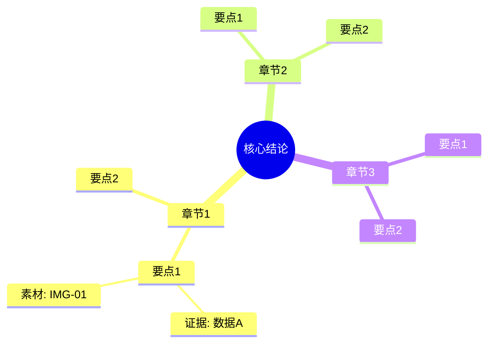

# Mermaid 导图与图表转化模板

## A) 思维导图模板（Mermaid）

## B) 流程图模板（Mermaid）

## C) 图表转化表模板

| 导图节点 | 关系类型 | 建议图表 | 建议页型 | 备注 |
|---|---|---|---|---|
| 章节A -> 要点1/2/3 | 层级 | 树状图 | 章节总览 | 不超过3层 |
| 要点A vs 要点B | 对比 | 双栏对照 | 对比页 | 用同口径指标 |
| 步骤1->2->3->4 | 顺序 | 流程图 | 流程页 | 每步一句话 |
| 指标月度变化 | 趋势 | 折线图 | 数据页 | 标注关键拐点 |
